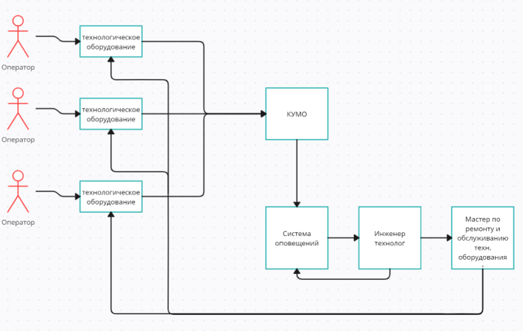

# Кибериммунное устройство мониторинга оборудования (КУМО).

## Краткое описание назначения и применения продукта.

КУМО получает данные от промышленного оборудования из внутренней сети, обрабатывает эти данные, в случае превышения пороговых значений генерирует события, которые пользователь из внешней сети может получить для дальнейшего анализа.

## Ценности продукта

- Информативность передаваемых данных.
- Корректность регистрации триггеров событий.
- Корректность передаваемых инструкций.
- Конфиденциальность информации о тех. процессе (коммерческая тайна).

## Неприемлемые события или сценарии в отношении ценностей продукта

- Сбой в работе сервера.
  - Нарушение тех. процесса.
  - Аварийные ситуации влекущие поломку оборудования.
  - Аварийные ситуации влекущие производственные травмы и/или гибель людей.
  - Простой оборудования.
- Вмешательство в передачу информации/сценариев.
  - Аварийные ситуации влекущие поломку оборудования.
  - Простой оборудования.
  - Утечка информации о тех. процессе.
  - Нарушение целостности передаваемой информации.

## Цели безопасности

- Возможность полного или частичного обновления КУМО.
- Доступ к информационной системе имеется только у авторизованных сотрудников имеющих право на доступ.
- Конфиденциальность данных о тех. процессе.
- Корректность регистрации триггеров событий.
- Корректность передаваемых инструкций.

## Предположения безопасности

- Авторизованные сотрудники с правом на доступ к информационной системе считаются благонадежными.

- Потенциальные злоумышленники не имеют возможности физического воздействия на КУМО.

- Не существует технически осуществимого сценария компрометации данных аутентификации и авторизации.

- Во время передачи данных используется сквозное шифрование.

  

## Роли пользователей

#### Оператор технологического оборудования

* Мониторинг состояния закреплённого за оператором технологического оборудования.
* Мониторинг технического процесса проходящего на закреплённом за оператором технологическим оборудованием.

#### Инженер технолог

* Мониторинг состояния всего технологического оборудования на предприятии.
* Мониторинг всех технологических процессов процессов проходящих на предприятии.
* Управление системой оповещения аварийных ситуаций.
* Журнал обслуживания и ремонта технологического оборудования. 

#### Мастер бригады ремонта и обслуживания технологического оборудования

* Ремонт и обслуживания технологического оборудования на предприятии.

## Верхнеуровневые сценарии (режимы) работы продукта

